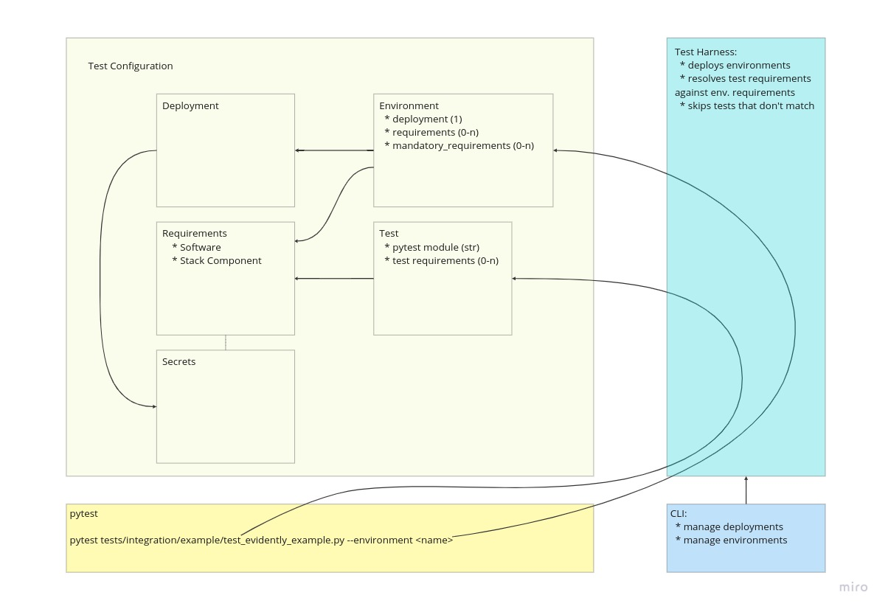

# The ZenML Test Framework, Strategy and Guidelines

ZenML is a rapidly growing project with a lot of moving parts. We have a
number of different core components and integrations often being developed in
parallel. This makes it very important to have a good test strategy in place to
ensure that we don't break anything when we make changes to the codebase.

The ZenML test framework is a collection of Python scripts and utilities that
allow us to quickly set up a variety of test environments and run tests on our
local machine or in the GitHub Actions CI/CD.

## Quick Intro

If you're only interested in quickly running some tests on your local machine,
you can skip the rest of this document and just follow the instructions in this
quick guide.

Tests require ZenML integrations to be installed in your Python virtual
environment. They are not installed by the test framework itself. You can
install ZenML plus all the integrations required by the tests with the following
command (preferably in a fresh virtual environment):

```bash
./scripts/install-zenml-dev.sh -i yes
```

Running unit tests is as simple as running `pytest` from the root of the
repository. This will run all unit tests in the `tests/unit` directory:

```bash
pytest tests/unit
```

Running integration tests with the default settings is somewhat similar, with
the difference that tests that require particular integrations or stack
component flavors to be provisioned will be skipped if these requirements are
not met:

```bash
pytest tests/integration
```

To unlock the full potential of the integration test framework, you should do
this in four simple steps instead:

1. Choose a test environment that you want to run the tests on. This can be done
with the test framework CLI, e.g.:

```
./zen-test environment list

┏━━━━━━━━━━━━━━━━━━━━━━━━━━━━━━━━┯━━━━━━━━━━━━━━━━━━━━━━━┯━━━━━━━━━━━━━━━━━━━━━━━━━━━━━━━━┯━━━━━━━━━━┯━━━━━━━━━┯━━━━━━━━━━━━━┓
┃              NAME              │ DEPLOYMENT            │ DESCRIPTION                    │ DISABLED │ RUNNING │ PROVISIONED ┃
┠────────────────────────────────┼───────────────────────┼────────────────────────────────┼──────────┼─────────┼─────────────┨
┃            default             │ default               │ Default deployment with local  │          │ ✅      │             ┃
┃                                │                       │ orchestrator and all local     │          │         │             ┃
┃                                │                       │ components.                    │          │         │             ┃
┠────────────────────────────────┼───────────────────────┼────────────────────────────────┼──────────┼─────────┼─────────────┨
┃  default-docker-orchestrator   │ default               │ Default deployment with docker │          │ ✅      │             ┃
┃                                │                       │ orchestrator and all local     │          │         │             ┃
┃                                │                       │ components.                    │          │         │             ┃
┠────────────────────────────────┼───────────────────────┼────────────────────────────────┼──────────┼─────────┼─────────────┨

...

┠────────────────────────────────┼───────────────────────┼────────────────────────────────┼──────────┼─────────┼─────────────┨
┃ local-server-airflow-orchestra │ local-server          │ Local server deployment with   │          │         │             ┃
┃              tor               │                       │ local airflow orchestrator and │          │         │             ┃
┃                                │                       │ all local components.          │          │         │             ┃
┠────────────────────────────────┼───────────────────────┼────────────────────────────────┼──────────┼─────────┼─────────────┨
┃         docker-server          │ docker-compose-server │ Server docker-compose          │          │         │             ┃
┃                                │                       │ deployment with local          │          │         │             ┃
┃                                │                       │ orchestrator and all local     │          │         │             ┃
┃                                │                       │ components.                    │          │         │             ┃
┠────────────────────────────────┼───────────────────────┼────────────────────────────────┼──────────┼─────────┼─────────────┨
┃ docker-server-docker-orchestra │ docker-compose-server │ Server docker-compose          │          │         │             ┃
┃              tor               │                       │ deployment with docker         │          │         │             ┃
┃                                │                       │ orchestrator and all local     │          │         │             ┃
┃                                │                       │ components.                    │          │         │             ┃
┗━━━━━━━━━━━━━━━━━━━━━━━━━━━━━━━━┷━━━━━━━━━━━━━━━━━━━━━━━┷━━━━━━━━━━━━━━━━━━━━━━━━━━━━━━━━┷━━━━━━━━━━┷━━━━━━━━━┷━━━━━━━━━━━━━┛
```

2. Provision the test environment. This will configure and start a local ZenML
deployment and will register and provision the stack components that are
configured for the environment. (Note that some environments require the 
`docker-composer-v2` pip package to be installed, so make sure to do that.

The test framework will also take care of
rebuilding the ZenML container images that are required for the server to run
or for the pipelines to be executed. E.g.:

```
$ ./zen-test environment provision docker-server

INFO:root:Building ZenML server image 'localhost/zenml-server' locally
Using Dockerfile /home/stefan/aspyre/src/zenml/docker/zenml-server-dev.Dockerfile.
Creating Docker build context from directory /home/stefan/aspyre/src/zenml.
Using dockerignore file /home/stefan/aspyre/src/zenml/.dockerignore to create docker build context.
Building Docker image localhost/zenml-server.
Building the image might take a while...
Step 1/12 : ARG PYTHON_VERSION=3.9
Step 2/12 : FROM python:${PYTHON_VERSION}-slim AS base
Step 3/12 : ENV PYTHONFAULTHANDLER=1     PYTHONUNBUFFERED=1     PYTHONHASHSEED=random     PIP_NO_CACHE_DIR=1     PIP_DISABLE_PIP_VERSION_CHECK=1     ZENML_DEBUG=1     ZENML_LOGGING_VERBOSITY=INFO     ZENML_CONTAINER=1
Step 4/12 : WORKDIR /zenml
Step 5/12 : COPY README.md pyproject.toml ./
Step 6/12 : COPY src/zenml/__init__.py ./src/zenml/
Step 7/12 : RUN pip install -e .[server]
Step 8/12 : COPY src src
Step 9/12 : RUN mkdir -p .zenconfig/local_stores/default_zen_store
Step 10/12 : ENV ZENML_CONFIG_PATH=/zenml/.zenconfig     ZENML_DEBUG=true     ZENML_ANALYTICS_OPT_IN=false
Step 11/12 : ENTRYPOINT ["uvicorn", "zenml.zen_server.zen_server_api:app",  "--log-level", "debug"]
Step 12/12 : CMD ["--proxy-headers", "--port", "80", "--host",  "0.0.0.0"]
Finished building Docker image localhost/zenml-server.
INFO:compose.network:Creating network "docker-compose-server_default" with the default driver
Creating docker-compose-server_mysql_1 ... done
Creating docker-compose-server_zenml_1 ... done
INFO:root:Trying to connect to deployment 'docker-compose-server'...
Initializing the ZenML global configuration version to 0.23.0
INFO:root:Trying to connect to deployment 'docker-compose-server'...
INFO:root:Trying to connect to deployment 'docker-compose-server'...
INFO:root:Trying to connect to deployment 'docker-compose-server'...
Setting the global active project to 'default'.
Setting the global active stack to default.
INFO:root:Started docker-compose project 'docker-compose-server' for deployment 'docker-compose-server'.
INFO:root:Registered data_validator stack component 'deepchecks'
INFO:root:Registered data_validator stack component 'evidently'
INFO:root:Registered data_validator stack component 'great_expectations'
INFO:root:Registered data_validator stack component 'whylogs'
INFO:root:Registered experiment_tracker stack component 'mlflow-local'
INFO:root:Registered model_deployer stack component 'mlflow-local'
Environment 'docker-server' is provisioned and running at http://127.0.0.1:9000.
```

You can open the ZenML server UI and watch the pipelines execute in real time
while the tests are running.

3. Run the integration tests:

```bash
pytest tests/integration --environment docker-server --no-provision --cleanup-docker
```

Use the `--cleanup-docker` flag to cleanup any dangling docker containers,
volumes and images that might be created during the test run. The `--no-provision`
flag is used to skip provisioning the environment, which is already done in
step 2.

With an environment provisioned separately, you could even run the tests in
parallel, if you have enough resources, but be aware that there may still be a
few integration tests that were not written with parallelism in mind that may
occasionally fail due to interference between tests:

```bash
pytest tests/integration --environment docker-server --no-provision --cleanup-docker -n 4
```

Note that you need to `pip install pytest-xdist` to run the tests in parallel as
Pytest requires this plugin for parallelized testing.

4. Optionally, cleanup the test environment after tests are done:

```bash
./zen-test environment cleanup docker-server
```


## The Testing Strategy

There are many ways in which ZenML can be deployed and run, from the default
local client to ZenML servers running in the cloud. On top of that, there are
many different integrations and flavors of stack components that can combined
and used to run ZenML pipelines. It can be very challenging, time consuming and
resource intensive to test all possible combinations of these deployments and
stack configurations, which does not make it feasible to do so as part of a
CI/CD pipeline.  

The ZenML CI relies on a combination of unit tests, integration tests and
end-to-end system tests to ensure that the codebase is working as expected:

* unit-tests are tests that isolate and test a single unit of the codebase,
like a function, class or module. They are fast and should not usually require
any external dependencies or special deployment configurations like databases,
ZenML servers or other services. When they do, these dependencies should be
mocked and/or stubbed out.
* integration tests are tests that exercise an entire API or abstraction layer
(e.g. the ZenML CLI, Client, the ZenML store interface or the ZenML artifact
store abstraction) and test it against a real ZenML deployment or stack
component deployment, like a local ZenML server running in a Docker container,
a remote ZenML server running in the cloud or a cloud artifact store. Given
that the ZenML code is designed to be highly modular and extensible, it is often
the case that the integration tests don't need to be written for a particular
implementation of a given API or abstraction layer, but are reusable across
different implementations of the API or abstraction layer under test. This makes
it possible to write integration tests once and reuse them across different
deployments and stack configurations.
* end-to-end system tests are tests that exercise ZenML from an end-user
perspective, e.g. by running a full ZenML example project from start to finish
and verifying that the pipelines runs as expected. These tests are usually very
resource intensive and time consuming. Same as with integration tests, they
are often highly reusable across different deployments and stack configurations.

To address the mentioned concerns, the testing strategy chosen for ZenML can
be summarized as follows:

* all unit tests are run on a local ZenML deployment that is completely isolated
from the one used for development that they all share. Furthermore, every unit
test module is run in a separate ZenML repository and project by means of a
custom pytest fixture (`module_auto_clean_project`) that ensures that different
tests do not interfere with each other and, in theory, can even be run in
parallel, although there are some minor issues with some tests that need to be
addressed to make this possible. Unit tests that require a completely isolated
ZenML deployment use the `clean_client` fixture to set up a temporary client
with its own independent global configuration.

* integration and end-to-end system tests are generally written so that they are
independent of the type of ZenML deployment (e.g. local, docker, cloud) and
even independent of the particular types of stack component flavors that they
are run against. This makes it possible to run the same tests against different
deployments and stack configurations. Tests that do have some requirements
concerning for example the integrations or stack components that they need to
run can specify these requirements and the ZenML test framework will make sure
to only run them against test setups that meet these requirements, as explained
in the next section.

Generally speaking, all tests should be written in a way that allows them to
be run independently of other tests and in any order. They should also be
mindful about the ZenML resources that they create (e.g. stack components,
stacks, users, pipelines etc.) and clean up after themselves or use one of the
custom pytest fixtures that are provided by the test framework for this purpose. 

## The Test Framework

We use a combination of [pytest](https://docs.pytest.org/en/stable/) with some
of our own home-brewed test automation code for our test framework. This
includes a test harness responsible for automating the deployment and
provisioning of local and remote test environments and some custom fixtures and
context managers that make it easier to write tests.

The test framework is primarily concerned with the following tasks:

* setting up and tearing down local *ZenML test deployments*
* creating, provisioning and deleting *ZenML test environments*
* matching the *test requirements* defined for tests with the capabilities of
the *ZenML test environment* that they're running on and skipping those tests
that cannot have their requirements met
* setting up and tearing down temporary ZenML stacks that reflect both the
capabilities of the ZenML test environment and the test requirements, when asked
to do so by a test or set of tests

The test framework is *not* responsible for:

* setting up Python environments and installing Python packages, ZenML
integrations and system tools like Docker, Kubernetes, etc. This is the
responsibility of the developer or CI/CD system that runs the tests.
* the actual execution of tests, collection of test results etc. This is done
through pytest.



The ZenML test framework uses a few concepts summarized in the above diagram
that are important to understand in order to be able to write and/or execute
tests. These are clarified in the next sections.

### The ZenML Test Configuration

Everything that is needed to run ZenML tests, from test environments to the
requirements that individual tests have, is defined through a set of YAML files
that are located in the `tests/harness/cfg` directory. These files are meant to
be edited by hand and can be organized in any way that makes sense, using any
directory structure and any file names. The test framework automatically
discovers all YAML files in this directory, merges them and loads them into a
single `Configuration` object that it uses to figure out what it needs to do.

The following elements, at a glance, can be specified in the
*Test Configuration*:

* ZenML test deployments and their configuration
* ZenML test environments and their configuration
* test requirements
* secrets

The test configuration folder already contains a number of files with
pre-defined test deployments, environments and test requirements that can be
used to run tests against. These files include detailed information on how to
configure these elements.

### ZenML Test Deployments

A ZenML test deployment describes basically two things: how a ZenML deployment
can be locally set up and torn down and how a ZenML client can be configured
to access it. For the default case, the local client and the local ZenML
deployment are one and the same, but this is not always the case. Here are
some examples of ZenML test deployments that are currently supported by the
test framework:

* a ZenML server running locally as a daemon process (same result as running
`zenml up`)
* a ZenML server running in a Docker container (same result as running
`zenml up --docker`)
* a ZenML server and a MySQL server both running in Docker containers and
managed by Docker Compose
* an external ZenML server running in the cloud.

In the external server case, the server is not managed by the test framework
and the test framework only needs to know how to configure the ZenML
clients used by tests to connect to it. In all other cases, the test framework
is also responsible for setting up and tearing down the local ZenML deployment
in addition to configuring the ZenML clients used by the tests.

The following is a sample configuration for a local ZenML server deployment
that is the equivalent of running `zenml up --docker`:

```yaml
deployments:
  - name: docker-server
    description: >-
      Local ZenML server running in docker.
    type: server
    setup: docker
    capabilities:
      server: true
```

For more information about the different types of ZenML deployments and how
they can be configured, see the `tests/harness/cfg/deployments.yaml` file.

ZenML test deployments can be managed through the `./zen-test deployment` CLI
commands.

### ZenML Test Requirements

Test requirements can be used to specify a set of software dependencies and
stack component configurations that 1. a test or set of tests needs to run
and 2. a ZenML test environment can provide or even enforce.

Let's take the MLflow experiment tracking example project as an example. This
project requires a ZenML stack with an MLflow experiment tracker stack
component. It also requires the `tensorflow` integration to be installed. The
following test requirement definition could be used to specify these
requirements:

```yaml
requirements:
  - name: mlflow_tracking_example
    integrations:
      - tensorflow
    stacks:
      - type: experiment_tracker
        flavor: mlflow

tests:
  - module: tests.integration.examples.test_mlflow_tracking
    requirements:
      - mlflow_tracking_example
```

A test environment on the other hand can be configured to provide a ZenML stack
with a local MLflow experiment tracker. In addition to that, you may also want
to enforce that a test environment provision and use a local Kubeflow
orchestrator stack component instead of the default local orchestrator, which
also requires a k3d container registry to be configured in the same stack. This
could be specified as follows:

```yaml
requirements:
  - name: local_mlflow_tracker
    stacks:
      - name: mlflow-local
        type: experiment_tracker
        flavor: mlflow

  - name: kubeflow_local
    system_tools:
      - docker
      - kubectl
      - k3d
    stacks:
      - name: k3d-local
        type: container_registry
        flavor: default
        configuration:
          uri: localhost:5000
      - name: kubeflow-local
        type: orchestrator
        flavor: kubeflow
        configuration:
          synchronous: true
          skip_ui_daemon_provisioning: true

environment:
  - name: local_kubeflow_with_mlflow
    deployment: docker-zenml-server
    requirements:
      - local_mlflow_tracker
    mandatory_requirements:
      - kubeflow_local
```

When running the `test_mlflow_tracking` test against the
`local_kubeflow_with_mlflow` test environment with:

```bash
pytest tests/integration/examples/test_mlflow_tracking.py --environment local_kubeflow_with_mlflow
```

and given this simple configuration, the test framework will perform the
following:

* it will make sure that the `docker-zenml-server` test deployment is
up and running. If this is a local deployment, it will provision it first.
* it will check that software requirements are installed:

  * the `docker`, `kubectl` and `k3d` system tools
  * the `mlflow` and `kubeflow` ZenML integrations required by the stack
  components
  
  NOTE: if any of these requirements are not met for an optional requirement,
  the framework will skip registering and provisioning stack components at the
  next step. If requirements are not met for a mandatory requirement, an error
  will be raised.

* it will register the `mlflow-local`, `k3d-local` and `kubeflow-local` ZenML
stack components with the `docker-zenml-server` deployment
* it will then provision all registered stack components, including the
`kubeflow-local` orchestrator, which results in a k3d cluster being set up
locally and Kubeflow being installed into it (i.e. same result as running
`zenml orchestrator up`)
* next, the test framework will check that the test requirements are met:

  * the `tensorflow` integration is installed
  * an MLflow experiment tracker stack component is registered
  
  NOTE: if any of these requirements are not met, the test will be skipped.

* finally, the test will be executed

Test requirements can be defined globally and referenced in individual tests
and test environments by name, or they can be declared inline within the
test environment or test definition.

For more information about ZenML test requirements and how they can be
configured, see the `tests/harness/cfg/requirements.yaml` file.


### ZenML Test Environments

As briefly mentioned in the previous section, a ZenML test environment pairs a
test deployment with a set of test requirements. The test requirements specify
what stack components need to be configured and provisioned by the test
framework onto the deployment to be used by tests.

Some test requirements can be marked as mandatory, which means that the test
framework will raise an error if they cannot be provisioned due to missing
integrations or system tools. A mandatory stack component will also be
provisioned and included in all stacks that are automatically provisioned by the
test framework for tests that need them. This can be used for example to enforce
a particular orchestrator or artifact store to be used for end-to-end system
tests that need an entire ZenML stack to be provisioned.

## The ZenML Test CLI

The ZenML test CLI is a command line interface that can be used to display
information about the configured test deployments and test environments and
manage their lifecycle. The `zen-test` command in the repository root can be
used to run the ZenML test CLI.

### Managing ZenML Test Deployments

The following commands can be used to manage ZenML test deployments:

* `./zen-test deployment list` - lists all configured ZenML test deployments.
* `./zen-test deployment up <deployment-name>` - starts up a local ZenML test
deployment. For example, for a local ZenML server deployment, this will start
the local ZenML server as a daemon process, same as running `zenml up`.
* `./zen-test deployment down <deployment-name>` - tears down a local ZenML
test deployment. For example, for a local ZenML server deployment, this will
stop the local ZenML server, same as running `zenml down`.
* `./zen-test deployment cleanup <deployment-name>` - tears down a local ZenML
test deployment and cleans up all local files associated with it. Local files
means things like local SQLite databases and ZenML client configuration files
that are used by the test framework to manage the deployments.
* `./zen-test deployment exec <deployment-name> <command-args>...` - runs a
ZenML CLI command against a ZenML test deployment. For example, running
`./zen-test deployment exec docker stack list` will run the `zenml stack list`
command against the `docker` ZenML test deployment. The test framework takes
care of configuring and using a ZenML client connected to the deployment.

### Managing ZenML Test Environments

The following commands can be used to manage ZenML test environments:

* `./zen-test environment list` - lists all configured ZenML test environments
* `./zen-test environment up <environment-name>` - starts up the ZenML test
deployment associated with the test environment.
* `./zen-test environment provision <environment-name>` - starts up the ZenML
test deployment and provisions all stack components required by a test
environment.
* `./zen-test environment deprovision <environment-name>` - deprovisions all
stack components required by a test environment.
* `./zen-test environment down <environment-name>` - deprovisions all
stack components required by a test environment and tears down the ZenML test
deployment.
* `./zen-test environment cleanup <environment-name>` - similar as `down`, but
also cleans up all local files associated with the ZenML test deployment.
