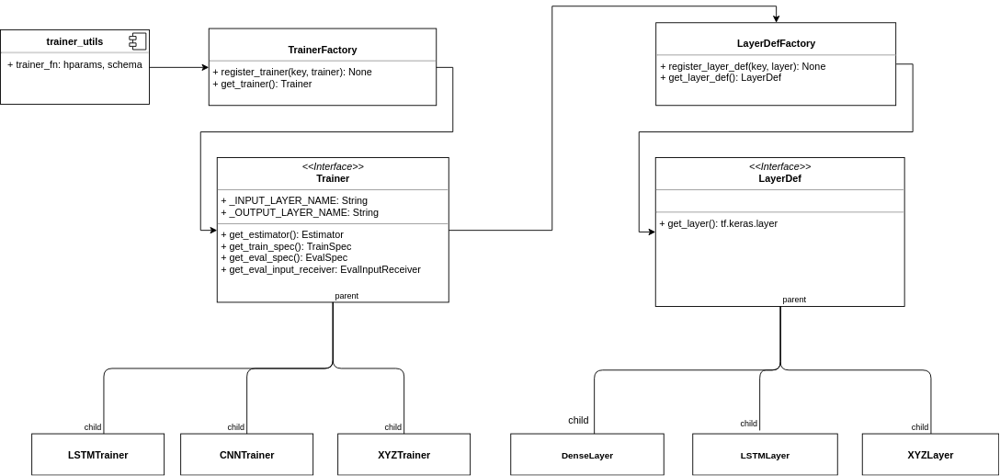

# The Trainer

The trainer is one of the more complicated components, so we include a
small README in order to explain it. A large portion of the inspiration of this
design came from [Isaac Rogriguez's excellent blog post](https://realpython.com/factory-method-python/)
over at realpython. A must-read for people reading these words!

## Overview Class Diagram
Here is an overview UML-style class diagram of how our codebase is designed:

## Explanation

### TFX
TFX is designed to call a function with
the signature `trainer_fn(hparams, schema).` This function in turn has to 
return four parameters, namely:

* estimator: A tensorflow estimator with the model layer design
* trainer_spec: Specifications for the training
* eval_spec: Specification for the evaluation and serving
* eval_input_receiver: A function that is called by the Evaluator component.

As we do not have direct access to `hparams`, we will cheat a bit and use an 
external `trainer_config.yaml` file to parameterize this function.

### Trainer and TrainerFactory
We have designed our codebase in a way that an interface is called
that will return the four objects inside the trainer_fn call 
As we do not have direct access to `hparams`, we will cheat a bit and use an 
external `trainer_config.yaml` file to parameterize this function
(see the relevant four getter functions in the diagram above). We call this
interface the **`Trainer`** interface.

As this interface has many differently styled implementations, we bind a string
'key' to each concrete implementation and design a factory class called `TrainerFactory`
that is responsible for instantiating these objects. The key to get a certain implementation is then retrieved from
the `trainer_type` key defined in the`trainer_config.yaml` file.

For example, the key **lstm** maps to a `LSTMTrainer` instance which implements
the `Trainer` interface.

In this manner, the complexity of instantiation of `Trainer` impl objects with different
parameters is abstracted away into the factory and away from our caller.
The caller simply has to hand over all the parameters it gets from the YAML
directly to the `Trainer` impl it gets from the factory.

### LayerDef and LayerDefFactory
Similar to the `TrainerFactory`, there is also a need for a `LayerDefFactory`,
which is actually used by the concrete `Trainer` implementations within
their `get_estimator()` method.

In this case, there are many different tf.keras layers with different implementation
details. For example, `tf.keras.layers.LSTM()` defines a `return_sequences` parameter
but `tf.keras.layers.Dense()` has no such parameter. To abstract away the complexity
of creating such objects away from the `Trainer`, we create a simple `LayerDef`
interface that simply returns a layer fully defined. Again, we use the concept
of a `LayerDefFactory` to map a key to the `LayerDef` implementation itself. 

This key is found again in the `trainer_config.yaml`, but this time
within the `layers` dict with the `type` key.
